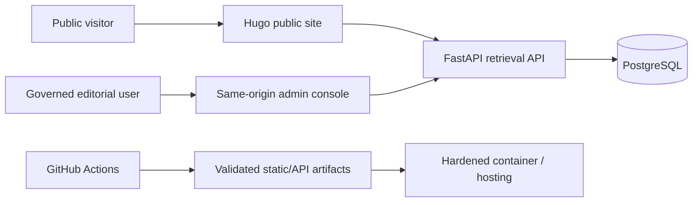
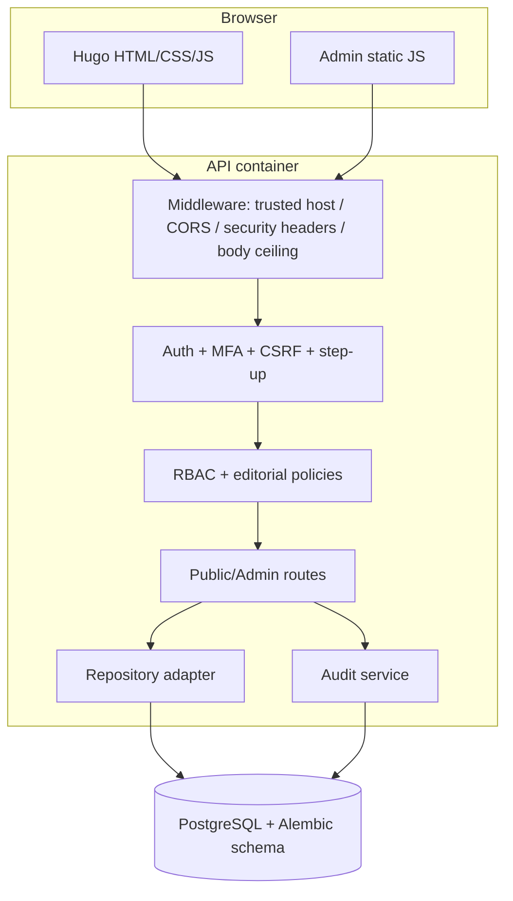
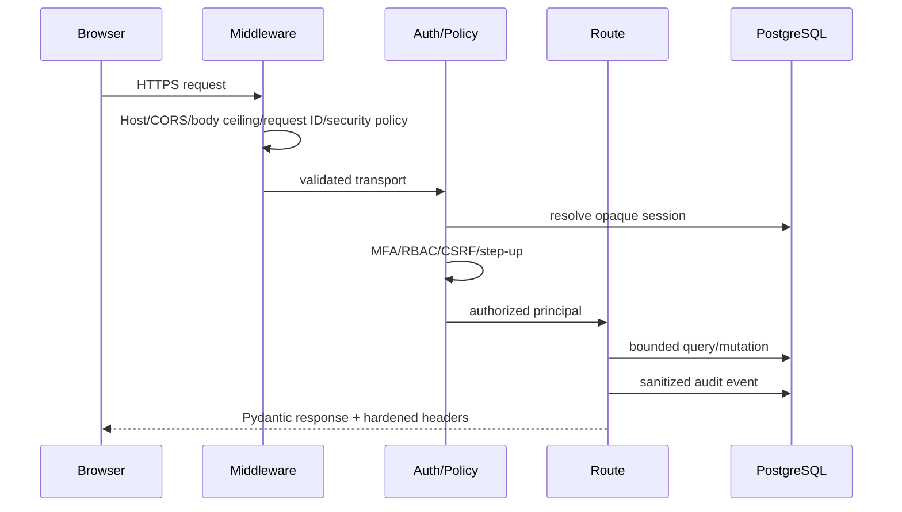

# AISearcharab — Architecture

## C4 — System context



AISearcharab is an Arabic-first observatory and governed retrieval/editorial platform. Generated answers, crawling and payments are disabled capabilities in the current release line.

## C4 — Containers



## Component boundaries

- `schemas.py`: Pydantic transport contracts and boundary validation.
- `auth.py`: principal resolution, MFA requirement, permission, CSRF and step-up policy.
- `rbac.py`: role-to-permission policy; routes do not invent role rules independently.
- `audit.py`: audit-event sanitization and persistence entry point.
- `repository.py`: persistence/query adapter for public content/search retrieval.
- `database.py`: SQLAlchemy session/engine boundary.
- `middleware.py`: transport-wide controls; request body ceiling is separated from response-header/logging concerns.
- `routes_*`: HTTP orchestration only; database access that still appears in admin routes is bounded by centralized auth/policy dependencies.

## Adapter pattern

The current provider boundary is intentionally small:

```text
HTTP routes -> repository/database modules -> SQLAlchemy -> PostgreSQL
```

PostgreSQL-specific Arabic FTS is isolated behind repository functions rather than browser code or templates. The public Hugo search can use the API and retains a static `/index.json` fallback. No browser database SDK, Supabase service role, storage SDK or cloud-vendor credential is embedded in the client.

A vendor-specific external deployment layer is not encoded into application domain logic. DNS, WAF/rate limiting, managed PostgreSQL, secret manager, logs/metrics and hosting remain deployment concerns proven by Staging evidence.

## Zero-trust boundaries

1. The browser is untrusted.
2. Cookies are opaque; session secrets are never stored in browser persistent storage.
3. Every privileged request resolves the current server-side session and role.
4. Mutations require explicit permission and CSRF; sensitive mutations additionally require current-password step-up.
5. Privileged roles require TOTP in staging/production configuration.
6. Editorial publication enforces provenance and optional strict separation of duties.
7. Database credentials are server-only.
8. PostgreSQL RLS is not claimed in this architecture because there is no direct client-to-database access. Authorization is enforced at the API policy layer; adding direct client DB access is an architecture change requiring a separate RLS design and migration.

## Data flow



## Scalability and maintainability

- Search candidate windows and page sizes are bounded.
- SQLAlchemy relationships used by content retrieval use select-in loading to avoid obvious per-row relationship queries.
- Migrations are a separate operational step; readiness validates the expected schema revision in staging/production.
- Runtime containers are non-root and read-only.
- CI produces SBOM, dependency evidence, OpenAPI evidence and release evidence.
- External horizontal-scaling prerequisites—distributed rate limiting, managed database failover/PITR and external observability—remain production gates and are not simulated in application code.
